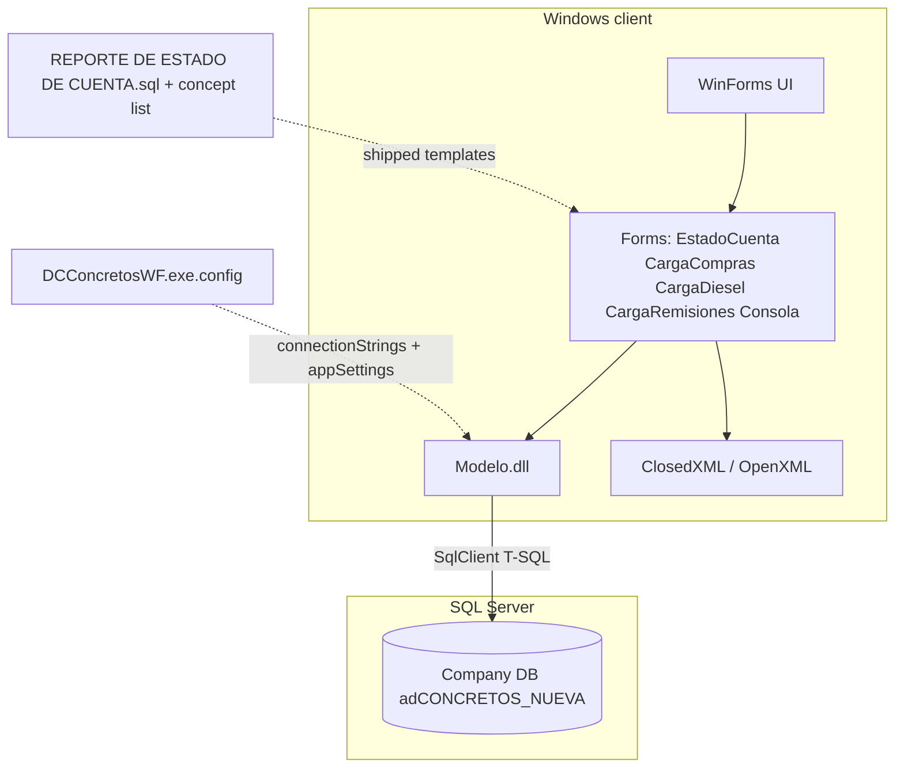

# Architecture and integration

## Logical view

The application is a **.NET WinForms** client deployed as **EXE + local DLLs + sidecar config**. It connects to the **CONTPAQi Comercial** company database on **Microsoft SQL Server** using **`System.Data.SqlClient`** (confirmed via `Modelo.dll` string metadata).

## Integration surfaces

1. **ADO.NET / T-SQL** — Primary evidenced path (`SqlConnection`, `SqlCommand`, `SqlDataReader` in `Modelo.dll`).
2. **External SQL template** — `REPORTE DE ESTADO DE CUENTA.sql` uses `{0}` date from, `{1}` date to, `{2}` concept IN list (application substitution).
3. **CONTPAQi Comercial product integration** — `usaContpaqi`, `NombreUsuarioComercial`, `PasswordUsuarioComercial`, `NombreEmpresaComercial`, and handler name `btnEnviarAComercial_Click` imply **a second integration** (SDK, automation, or file drop to Comercial). **Not proven** from strings alone; validate with runtime trace (`09`).

## Configuration contract

- **`connectionStrings/name="Comercial"`** — SQL connectivity.
- **`appSettings`** — business DB name + Comercial user toggles (see `01-environment-inventory.md`).

## Failure modes (operational)

- **SQL auth / `sa` lockdown** — tool stops if SQL login fails or rights trimmed without analysis.
- **Concept catalog drift** — if `CCODIGOCONCEPTO` values in Comercial change, filters in report/batch break silently or with empty results.
- **Network** — client must reach `Data Source` instance; VPN/LAN changes break connectivity.
- **Excel/OpenXML** — ClosedXML/OpenXml stack: corrupt template or oversized sheets can throw unhandled UI exceptions (to verify in Phase 2 with logging).

## Mermaid source

Diagram source lives in `appendix-diagrams/architecture.mmd` for easy export in Phase 2.
